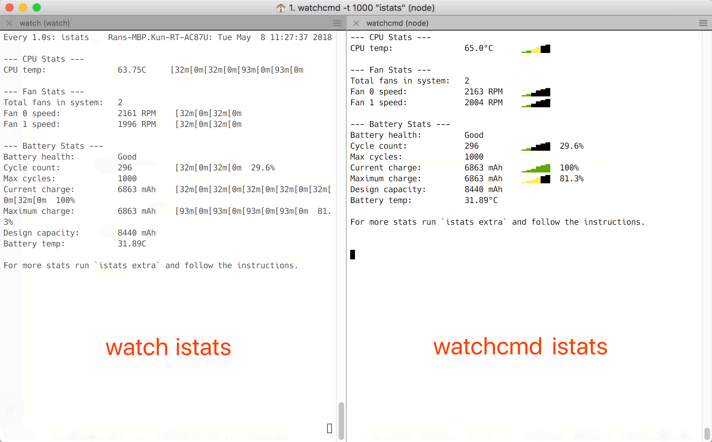

# Watchcmd (cli tool)

The simplest way to watch a command output.

## Install globally

```
$ npm i -g watchcmd
```

## Run it with any command

You can run command, string of commands, it will repeatedly report the result on the shell screen. e.g:

```
# Run istats every 2 seconds
watchcmd -t 2000 "istats"

# Append date after command output
watchcmd "istats; echo; date"
```

**Demo**

<a href="https://asciinema.org/a/180364" target="_blank"></a>

Commands used in this demo:

```
watchcmd istats
watchcmd "istats; echo; date"
watchcmd -t 2000 "istats; echo; date"
watchcmd -t 200 "istats; echo; date"
watchcmd "ping -c 1 www.github.com"
watchcmd "ping -c 1 www.github.com; echo; date"
```

## Help

```
➜  ~ watchcmd -h

  Usage: watchcmd [options] <cmd>

  Options:

    -V, --version       output the version number
    -t, --wait [value]  Wait for milliseconds
    -c, --cmd <value>   The command
    -h, --help          output usage information
```

Note:

- If your command has arguments, you will need to wrap them in quotation marks, like this:
  
  ```
  watchcmd "ping -c 1 www.github.com"
  ```

## Why watchcmd

### Watchcmd vs watch



Watchcmd's command can be further simplified as `watchcmd istats`, if you want it to be updated once per second.

NOTE: In some system, you can pass `--color` to watch to resolve this color commands issue.

### Watchcmd vs `while sleep...`

While

```
while sleep 1; do clear; istats; done
```

is a workable solution, but flicking. The ultimate `while` solution would be (it's fine to use it):

```
while sleep 1; do istats > /tmp/istats_file; date >> /tmp/istats_file; clear; cat /tmp/istats_file; done
```

But hey, isn't it complicated?

Watchcmd isn't that complicated, it's just a single JavaScript file that does all the hard work for you.

## Roadmap

- [ ] Add an argument to monitor content on screen and send notifications to user.
- [ ] Skip execution while the command is executing.
